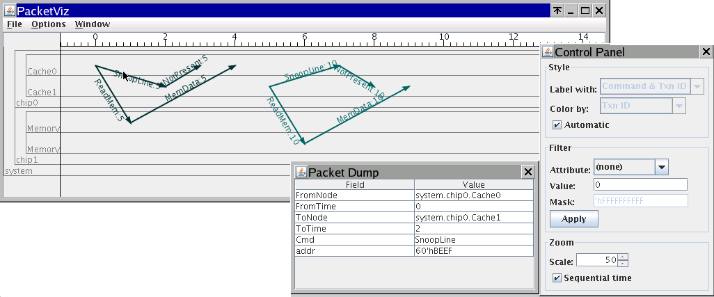
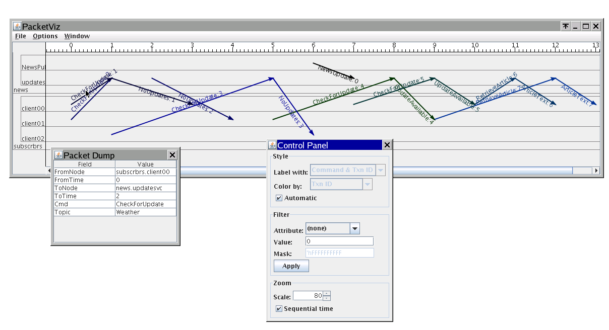

What is PacketViz?
----

PacketViz is a general packet or interaction graphing tool that can be used in a variety of applications including:

- Cache coherency "protocol flow diagrams"
- Networking packet diagrams
- Dynamic software interaction diagrams

What is the status of PacketViz?
----

PacketViz is relatively stable, having been used countless times at Newisys to analyze cache coherency simulations. Other than migration from SourceForge to GitHub and from Ant to Maven, it is unchanged since 2007.

Example Screenshots
----

### Cache Coherence

### News Feeder Service

How do I run PacketViz?
----

First, build PacketViz using Maven (with a default goal of `package`):

    $ mvn

Then, PacketViz can be run as an executable jar archive:

    $ java -jar pktviz/target/pktviz-shaded.jar

If you'd like to get a quick example to try out, download the source distribution and use an example ".pkt" file from the examples directory.

    $ java -jar pktviz/target/pktviz-shaded.jar pktviz/examples/version4_cache_flow.pkt

What platforms does PacketViz support?
----

PacketViz is written in pure Java 5, and should support any OS that can run a JRE version 1.5.0 or later.  It has been most recently tested with Oracle JRE 1.7.0.
